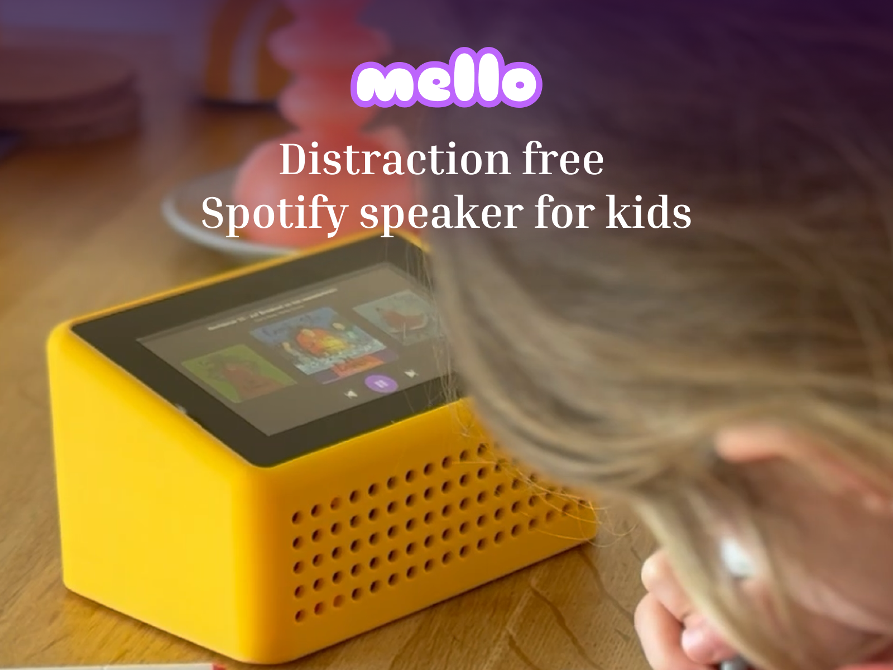

# Mello

A distraction free Spotify speaker for kids

Kids swipe through album covers and tap to play. Parents control the music library from Spotify on their phone.



### Build Video

[](https://youtu.be/4tn8OtKkvs8)

## Features

- **Spotify Connect** — Add albums and playlists from your Spotify app, Mello plays them
- **Album carousel** — Large cover art with smooth swipe navigation
- **Simple controls** — Play, pause, skip. That's it
- **Auto-sleep** — Screen turns off after 2 minutes of inactivity
- **Auto-pause** — Music stops after 30 minutes (configurable) to prevent all-day playback
- **Progress memory** — Remembers where each album left off for up to 96 hours
- **Bluetooth** — Connect wireless headphones or speakers
- **WiFi setup** — Creates a hotspot for easy configuration if WiFi drops
- **Auto-updates** — Pulls latest changes from GitHub nightly
- **No account needed on the device** — Authentication happens via Spotify on your phone

## Hardware

| Part | Link |
|------|------|
| Raspberry Pi 3 Model B | [Amazon](https://www.amazon.com/dp/B07BDR5PDW) |
| Raspberry Pi Touch Display 2 (5") | [Amazon](https://www.amazon.com/dp/B0FMYFKDLZ) |
| WM8960 Audio HAT | [Amazon](https://www.amazon.com/dp/B07KN8424G) |
| 5.1V 3A USB-C Power Supply | [Amazon](https://www.amazon.com/dp/B07RLG6THK) |
| USB-C Panel Mount Bushing | [Amazon](https://www.amazon.com/dp/B0CDC1X4BY) |
| Micro SD Card (16GB+) | — |

## Quick Start

### 1. Flash Raspberry Pi OS

Use the [Raspberry Pi Imager](https://www.raspberrypi.com/software/):
- Choose **Raspberry Pi OS Lite (64-bit)**
- Choose a hostname and username (e.g. `mello` / `mello`)
- Configure WiFi and enable SSH

### 2. Install Mello

```bash
ssh <your-user>@<your-hostname>.local
curl -sSL https://raw.githubusercontent.com/emieljanson/mello/main/install.sh | bash
sudo reboot
```

To install without anonymous usage analytics:

```bash
curl -sSL https://raw.githubusercontent.com/emieljanson/mello/main/install.sh | bash -s -- --no-analytics
```

### 3. Connect Spotify

1. Open Spotify on your phone
2. Tap the speaker icon
3. Select "Mello"
4. Start playing — it shows up on the touchscreen

## How It Works

Mello is a Python app using Pygame for the UI and [go-librespot](https://github.com/devgianlu/go-librespot) as a Spotify Connect receiver. When you select Mello as a speaker in Spotify and play an album, go-librespot handles the audio stream while Mello displays the album art and provides touch controls.

```
Your phone (Spotify app)
    │
    ▼
go-librespot (Spotify Connect daemon)
    │
    ▼
Mello (Pygame UI + touch input)
    │
    ▼
Touchscreen + Speaker
```

Albums and playlists you play are automatically saved to the device. Kids can then browse and play them independently from the touchscreen.

## Settings Menu

> **How to open:** Press and hold the volume button for 3 seconds. There's no gear icon or visible button — the long-press on the volume button is the only way in.

Once open, you'll see a scrollable menu with these sections:

### Connections
- **WiFi** — View saved networks, connect to a new one, or switch. If WiFi drops, Mello creates a "Mello-Setup" hotspot you can connect to from your phone
- **Bluetooth** — Pair and connect wireless headphones or speakers. Shows paired devices and nearby discoverable devices
- **Volume levels** — Set separate volume levels (low/mid/high) for the built-in speaker and Bluetooth output

### Playback settings
- **Auto-pause** — How long Mello plays before automatically pausing (15, 30, 60, or 120 minutes). Tap to cycle through options. Default: 30 minutes
- **Remember progress** — How long Mello remembers where each album left off (12, 24, 48, or 96 hours). Tap to cycle. Default: 96 hours

### System
- **Check for updates** — Manually check for and install updates (Mello also updates automatically each night)
- **Reset** — Factory reset: clears all albums, WiFi, Bluetooth, Spotify credentials, and settings. Requires a second tap to confirm

To close the menu, tap the **✕** in the top-right corner.

### Usage Data

During installation, Mello asks if you'd like to share anonymous usage data. This helps improve the project. Only session-level events are collected (play/pause, sleep/wake) — no personal data or music choices. The choice is made once during setup.

## Known Issues

**Spotify "audio key error" — tracks skip without playing.** This is an upstream issue in librespot (the library that handles Spotify Connect). It affects some Spotify accounts but not others, and there's no fix yet. Mello uses [go-librespot](https://github.com/devgianlu/go-librespot) which is affected by the same problem. Track the issue here: [librespot-org/librespot#1649](https://github.com/librespot-org/librespot/issues/1649)

## Show Off Your Build

Built a Mello? I'd love to see it! Share a photo on Twitter/X and tag [@emieljanson](https://x.com/emieljanson).

## Contributing

See [CONTRIBUTING.md](CONTRIBUTING.md) for development setup and guidelines.

## Security

See [SECURITY.md](SECURITY.md) for the security policy and responsible disclosure.

## License

[MIT](LICENSE)

## Acknowledgments

- [go-librespot](https://github.com/devgianlu/go-librespot) — Spotify Connect implementation
- [Pygame](https://www.pygame.org/) — UI framework
- [PostHog](https://posthog.com/) — Anonymous usage analytics
